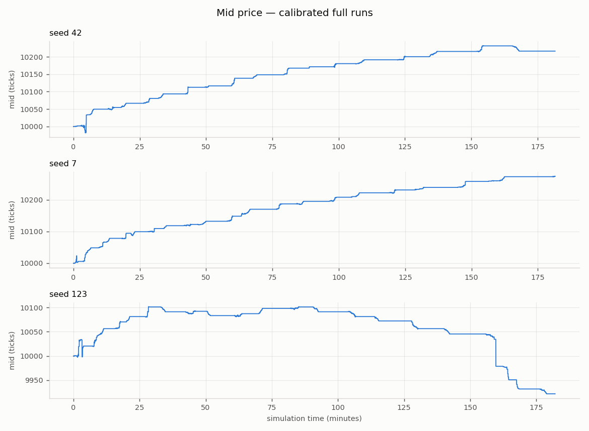
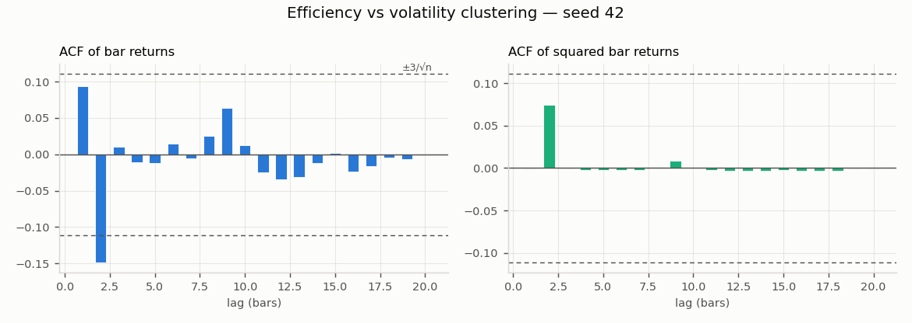
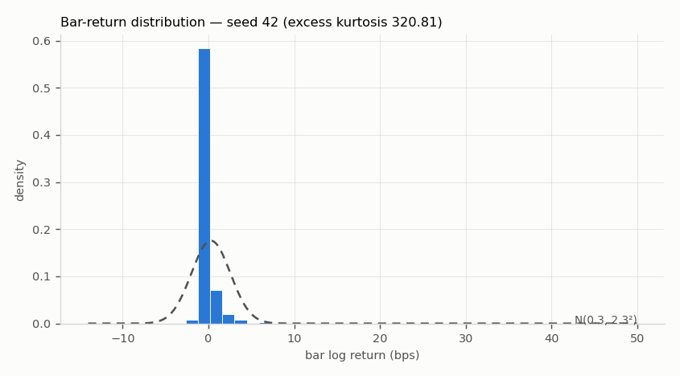
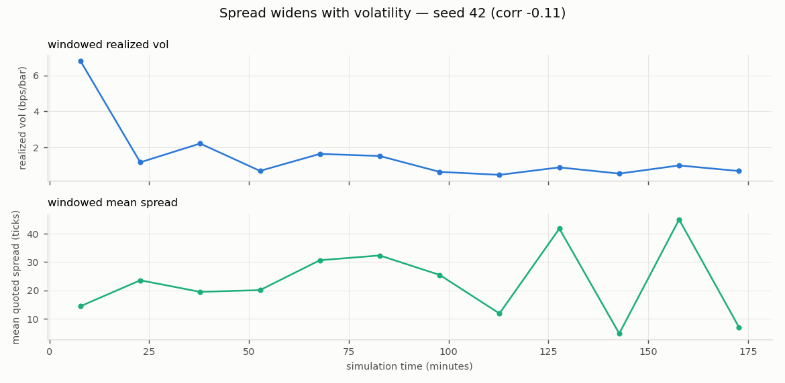
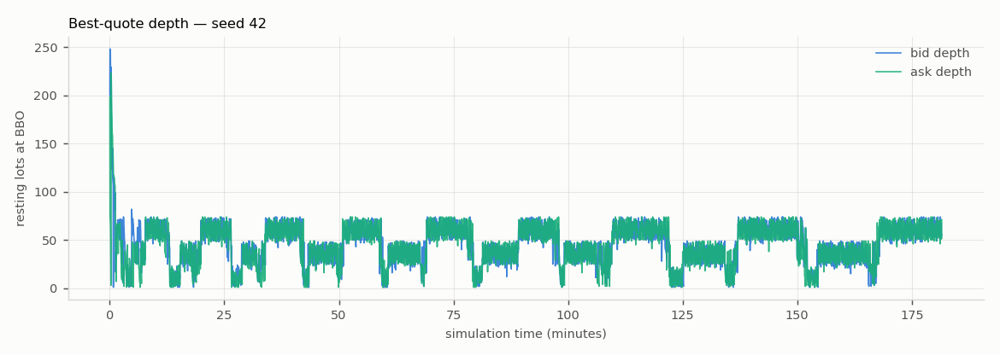

# Experiment: Ablation: vol_feedback off (baseline noise flow only)

*Generated 2026-07-15 by `run_experiment.py` —
config `sim/config/phase6.yaml`, seeds 42, 7, 123,
60,000 steps each, 0.25-minute bars,
61s wall time.*

Overrides: `{'agents.retail.vol_feedback': 0.0}`

## Stylised facts — 0/3 seeds all-green

| Stylised fact | seed 42 | seed 7 | seed 123 |
|---|---|---|---|
| positive spread | **PASS** | **PASS** | **PASS** |
| spread widens with vol | FAIL | FAIL | FAIL |
| price impact | **PASS** | **PASS** | **PASS** |
| return acf near zero | **PASS** | **PASS** | **PASS** |
| volatility clustering | FAIL | **PASS** | FAIL |
| fat tails | **PASS** | **PASS** | **PASS** |
| dealer delta flat | **PASS** | **PASS** | **PASS** |
| **total** | **5/7** | **6/7** | **5/7** |

## Microstructure metrics

| Metric | seed 42 | seed 7 | seed 123 |
|---|---|---|---|
| n_steps | 60000 | 60000 | 60000 |
| n_fills | 19611 | 19450 | 19440 |
| sim_minutes | 181.6 | 181.5 | 182.1 |
| bar_minutes | 0.25 | 0.25 | 0.25 |
| n_bars | 726 | 725 | 728 |
| realized_vol_annualised | 0.3292 | 0.2012 | 0.4292 |
| mean_quoted_spread_ticks | 22.97 | 21.09 | 23.58 |
| one_sided_snapshot_frac | 0 | 0 | 5e-05 |
| mean_effective_spread_bps | 22.88 | 20.53 | 23.57 |
| roll_measure_ticks | 33.38 | 31.66 | 34.22 |
| kyle_lambda | 0.004826 | 0.01011 | 0.0497 |
| mean_abs_return_acf | 0.02787 | 0.03887 | 0.03582 |
| ljung_box_q_sq_returns | 4.082 | 22.8 | 2.263 |
| ljung_box_p_sq_returns | 0.9436 | 0.01152 | 0.9939 |
| excess_kurtosis | 320.8 | 29.89 | 205.4 |
| n_option_trades | 847 | 884 | 937 |
| n_hedges | 505 | 554 | 536 |
| worst_post_hedge_delta_lots | 0.4999 | 0.5 | 0.4991 |
| gamma_rejections | 0 | 0 | 0 |
| option_cash_flow | 4.875e+04 | 5.804e+04 | 2.13e+04 |

## Figures (headline seed 42)

