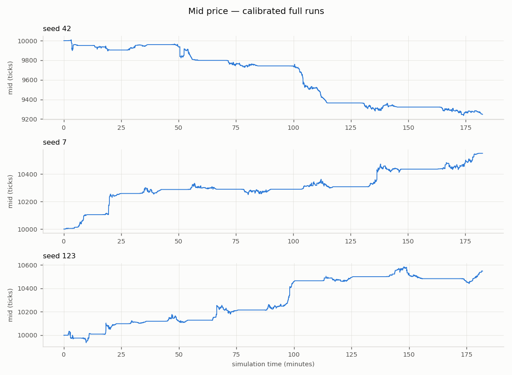
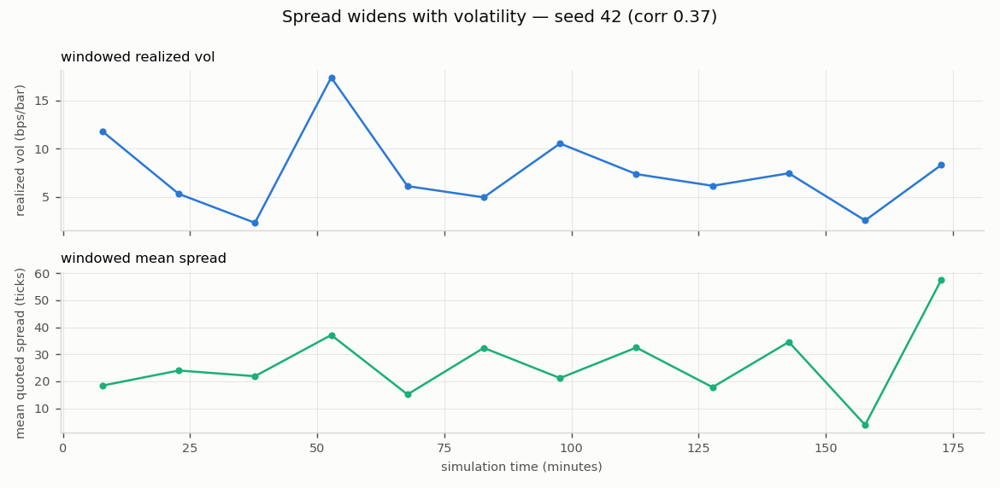

# Experiment: Validated flat-surface configuration (phase6.yaml), pre-registered seeds

*Generated 2026-07-15 by `run_experiment.py` —
config `sim/config/phase6.yaml`, seeds 42, 7, 123,
60,000 steps each, 0.25-minute bars,
60s wall time.*

Overrides: `none`

## Stylised facts — 2/3 seeds all-green

| Stylised fact | seed 42 | seed 7 | seed 123 |
|---|---|---|---|
| positive spread | **PASS** | **PASS** | **PASS** |
| spread widens with vol | **PASS** | **PASS** | **PASS** |
| price impact | **PASS** | **PASS** | **PASS** |
| return acf near zero | **PASS** | **PASS** | **PASS** |
| volatility clustering | **PASS** | **PASS** | FAIL |
| fat tails | **PASS** | **PASS** | **PASS** |
| dealer delta flat | **PASS** | **PASS** | **PASS** |
| **total** | **7/7** | **7/7** | **6/7** |

## Microstructure metrics

| Metric | seed 42 | seed 7 | seed 123 |
|---|---|---|---|
| n_steps | 60000 | 60000 | 60000 |
| n_fills | 21804 | 21374 | 21455 |
| sim_minutes | 182.3 | 182.6 | 182 |
| bar_minutes | 0.25 | 0.25 | 0.25 |
| n_bars | 729 | 730 | 727 |
| realized_vol_annualised | 1.243 | 0.8948 | 1.03 |
| mean_quoted_spread_ticks | 26.3 | 24.78 | 24.72 |
| one_sided_snapshot_frac | 0.0001833 | 6.667e-05 | 0.0001 |
| mean_effective_spread_bps | 32.65 | 28.2 | 28.19 |
| roll_measure_ticks | 29.56 | 30.25 | 29.22 |
| kyle_lambda | 0.09848 | 0.08325 | 0.07106 |
| mean_abs_return_acf | 0.04105 | 0.03472 | 0.0399 |
| ljung_box_q_sq_returns | 59.01 | 68.22 | 7.552 |
| ljung_box_p_sq_returns | 5.57e-09 | 9.772e-11 | 0.6725 |
| excess_kurtosis | 42.09 | 32.28 | 39.6 |
| n_option_trades | 889 | 891 | 873 |
| n_hedges | 619 | 593 | 564 |
| worst_post_hedge_delta_lots | 0.4999 | 0.4981 | 0.4998 |
| gamma_rejections | 0 | 0 | 0 |
| option_cash_flow | 3.994e+04 | 3.818e+04 | 5.928e+04 |

## Figures (headline seed 42)

