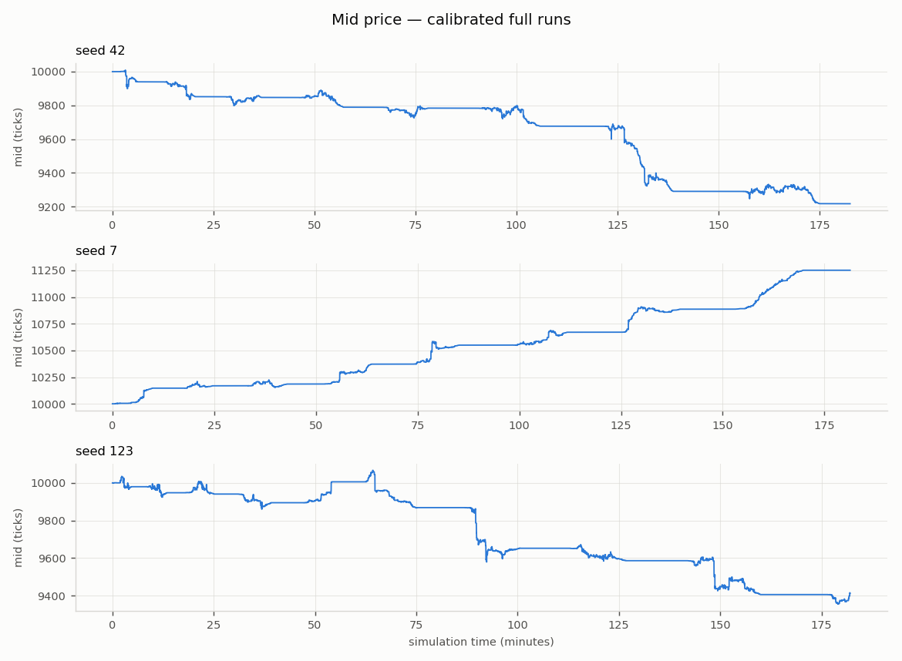
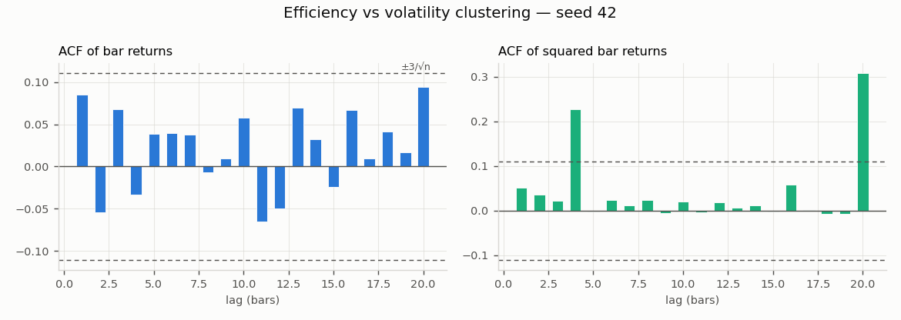
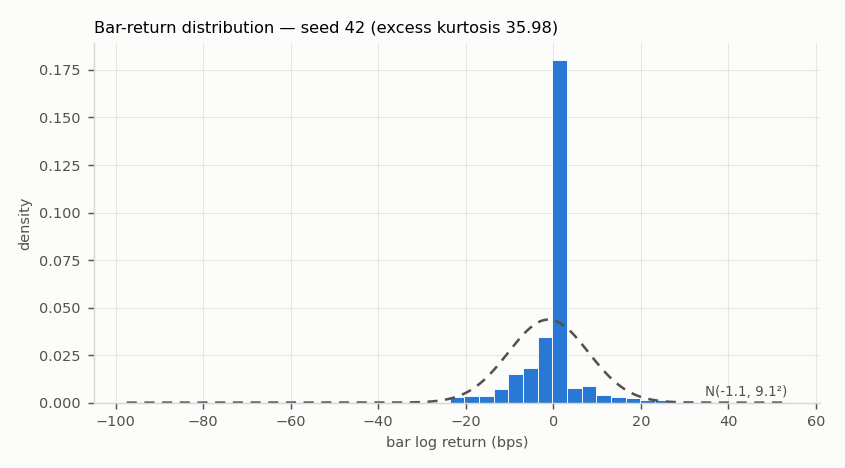
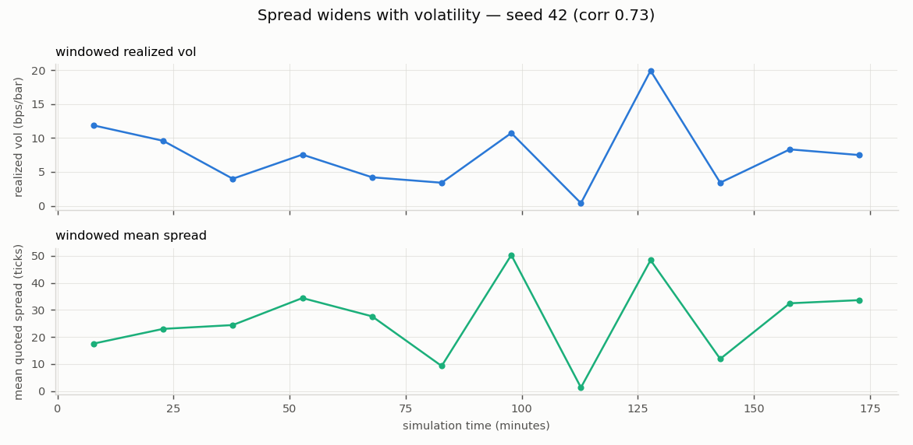
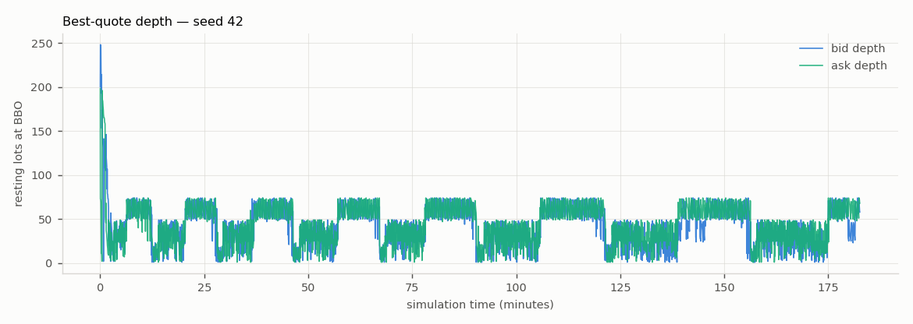

# Experiment: Calibrated EWMA dynamic-surface configuration (ewma_lambda 0.99)

*Generated 2026-07-15 by `run_experiment.py` —
config `sim/config/phase6_ewma.yaml`, seeds 42, 7, 123,
60,000 steps each, 0.25-minute bars,
69s wall time.*

Overrides: `none`

## Stylised facts — 3/3 seeds all-green

| Stylised fact | seed 42 | seed 7 | seed 123 |
|---|---|---|---|
| positive spread | **PASS** | **PASS** | **PASS** |
| spread widens with vol | **PASS** | **PASS** | **PASS** |
| price impact | **PASS** | **PASS** | **PASS** |
| return acf near zero | **PASS** | **PASS** | **PASS** |
| volatility clustering | **PASS** | **PASS** | **PASS** |
| fat tails | **PASS** | **PASS** | **PASS** |
| dealer delta flat | **PASS** | **PASS** | **PASS** |
| **total** | **7/7** | **7/7** | **7/7** |

## Microstructure metrics

| Metric | seed 42 | seed 7 | seed 123 |
|---|---|---|---|
| n_steps | 60000 | 60000 | 60000 |
| n_fills | 21965 | 20950 | 21988 |
| sim_minutes | 182.6 | 181.3 | 182.1 |
| bar_minutes | 0.25 | 0.25 | 0.25 |
| n_bars | 730 | 725 | 728 |
| realized_vol_annualised | 1.324 | 1.167 | 1.556 |
| mean_quoted_spread_ticks | 25.88 | 22.75 | 23.26 |
| one_sided_snapshot_frac | 0.0001 | 0.0001167 | 0.0001167 |
| mean_effective_spread_bps | 32.46 | 25.26 | 28.7 |
| roll_measure_ticks | 29.78 | 28.58 | 27.87 |
| kyle_lambda | 0.1051 | 0.09194 | 0.1132 |
| mean_abs_return_acf | 0.04497 | 0.04904 | 0.04062 |
| ljung_box_q_sq_returns | 42.61 | 57.11 | 82.84 |
| ljung_box_p_sq_returns | 5.848e-06 | 1.269e-08 | 1.388e-13 |
| excess_kurtosis | 35.98 | 39.75 | 46.7 |
| n_option_trades | 910 | 914 | 921 |
| n_hedges | 727 | 687 | 718 |
| worst_post_hedge_delta_lots | 0.4999 | 0.4992 | 0.4999 |
| gamma_rejections | 0 | 0 | 0 |
| option_cash_flow | 4.252e+04 | -1.035e+04 | -6.395e+04 |

## Figures (headline seed 42)

