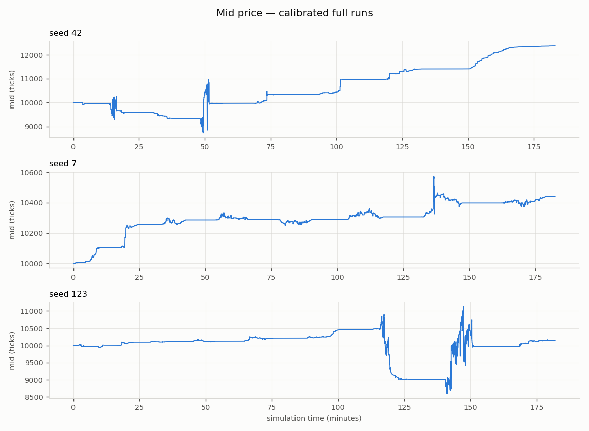
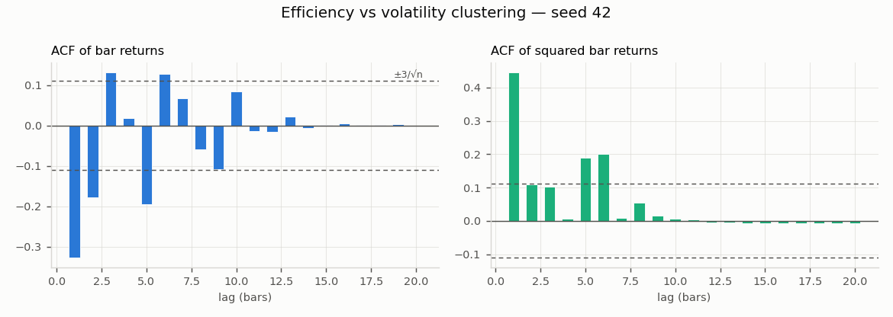
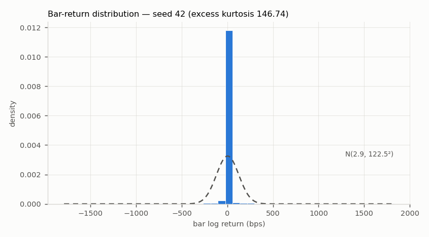
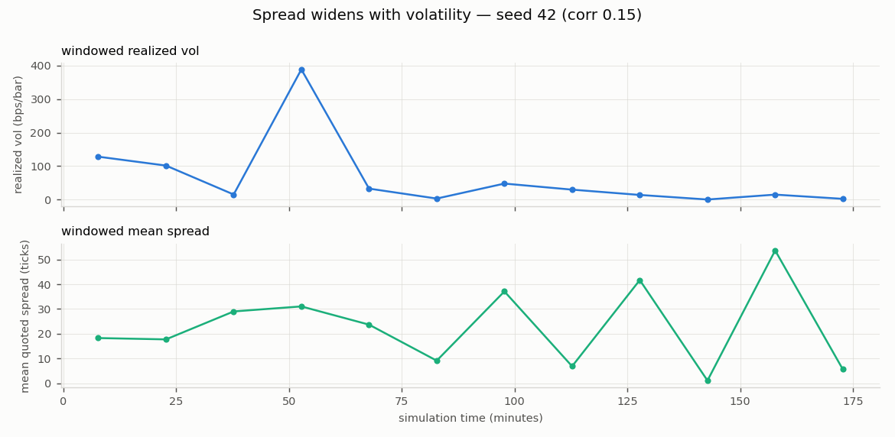
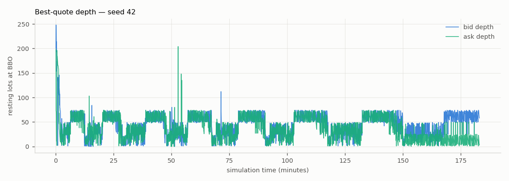

# Experiment: Mechanism study: calm/excited sentiment regime on top of vol_feedback

*Generated 2026-07-15 by `run_experiment.py` —
config `research/configs/phase6_regime.yaml`, seeds 42, 7, 123,
60,000 steps each, 0.25-minute bars,
69s wall time.*

Overrides: `none`

## Stylised facts — 1/3 seeds all-green

| Stylised fact | seed 42 | seed 7 | seed 123 |
|---|---|---|---|
| positive spread | FAIL | **PASS** | FAIL |
| spread widens with vol | FAIL | **PASS** | FAIL |
| price impact | **PASS** | **PASS** | **PASS** |
| return acf near zero | FAIL | **PASS** | FAIL |
| volatility clustering | **PASS** | **PASS** | **PASS** |
| fat tails | **PASS** | **PASS** | **PASS** |
| dealer delta flat | FAIL | **PASS** | FAIL |
| **total** | **3/7** | **7/7** | **3/7** |

## Microstructure metrics

| Metric | seed 42 | seed 7 | seed 123 |
|---|---|---|---|
| n_steps | 60000 | 60000 | 60000 |
| n_fills | 21571 | 21517 | 22606 |
| sim_minutes | 183.1 | 182.6 | 182 |
| bar_minutes | 0.25 | 0.25 | 0.25 |
| n_bars | 732 | 730 | 728 |
| realized_vol_annualised | 17.77 | 1.293 | 14.69 |
| mean_quoted_spread_ticks | 22.63 | 24.78 | 25.81 |
| one_sided_snapshot_frac | 0.002683 | 0.00025 | 0.005417 |
| mean_effective_spread_bps | 31.27 | 28.74 | 39.68 |
| roll_measure_ticks | 27.24 | 30.31 | 29.9 |
| kyle_lambda | 0.8507 | 0.0873 | 0.5715 |
| mean_abs_return_acf | 0.06828 | 0.03802 | 0.09738 |
| ljung_box_q_sq_returns | 222.1 | 209.3 | 46.53 |
| ljung_box_p_sq_returns | 3.866e-42 | 1.843e-39 | 1.15e-06 |
| excess_kurtosis | 146.7 | 134.8 | 93.66 |
| n_option_trades | 917 | 887 | 877 |
| n_hedges | 608 | 574 | 673 |
| worst_post_hedge_delta_lots | 7.779 | 0.4999 | 14.53 |
| gamma_rejections | 0 | 0 | 0 |
| option_cash_flow | 2.537e+04 | 7922 | 4.804e+04 |

## Figures (headline seed 42)

