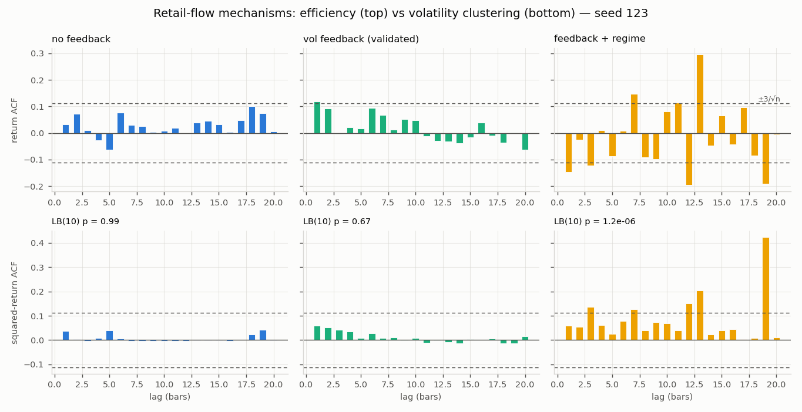
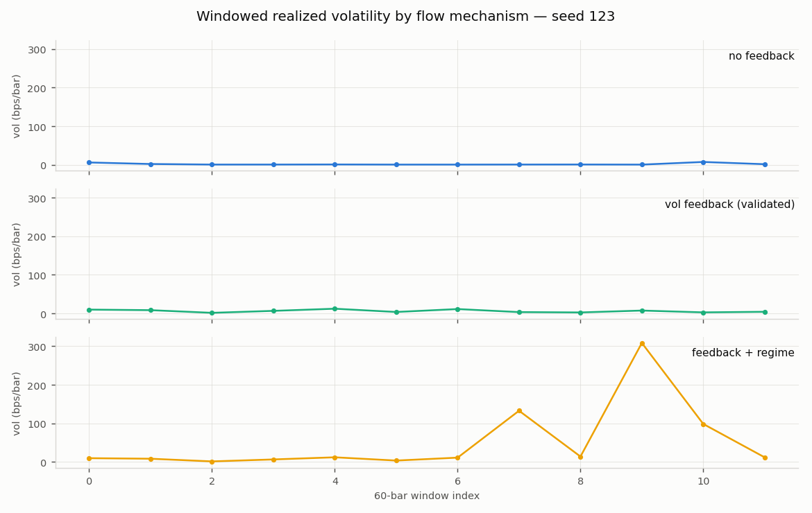

# Emergent Stylised Facts in a Closed-Loop Agent-Based Equity–Options Market with Delta-Hedging Feedback

**Working paper — gammarket project, July 2026**

*Generated from the gammarket simulator; every number, table, and figure in
this paper is reproducible from the commands in `README.md` at the git
commit recorded in each experiment's `manifest.json`.*

---

## Abstract

We present a closed-loop, multi-agent simulator of an equity limit order
book coupled to a quote-driven options market through a delta-hedging
dealer, and ask which of the canonical stylised facts of asset returns
[Cont, 2001] the system reproduces endogenously. Price dynamics arise
solely from the interaction of Poisson noise traders, a mean-reverting
institutional speculator, two inventory-managing market makers
[Avellaneda and Stoikov, 2008], and an options dealer whose Black–Scholes
delta hedges [Black and Scholes, 1973] feed back into the underlying book
[Frey and Stremme, 1997]. Under a calibrated configuration the simulator
reproduces seven pre-registered stylised facts — positive spread,
spread–volatility comovement, price impact [Kyle, 1985], near-zero return
autocorrelation, volatility clustering [Engle, 1982], fat tails
[Mandelbrot, 1963], and post-hedge dealer delta neutrality — on the
pre-registered seed set at a fixed measurement specification. We report
three findings beyond the validation itself. First, volatility clustering
does not arise from zero-intelligence flow alone [Gode and Sunder, 1993;
Farmer et al., 2005]: it requires a self-exciting flow mechanism, and we
compare two (size-in-vol feedback and a latent calm/excited sentiment
regime in the spirit of Lux and Marchesi [1999]). Second, the structural
regime mechanism makes clustering essentially guaranteed but inflates the
sample autocorrelation of returns beyond the i.i.d. ±3/√n band — the
textbook consequence of conditional heteroskedasticity for ACF-based
efficiency tests [Romano and Thombs, 1996] — so a validation gate that
tests both facts against i.i.d. bands penalises the very structure it
demands. Third, the dealer's implied-volatility input matters for the
verdict: a fast EWMA realized-vol surface [J.P. Morgan/Reuters, 1996]
degrades several facts by making the dealer's quotes and hedges chase
measurement noise, while a slow surface (λ = 0.99) weakly dominates the
static surface, passing all seven facts on all three pre-registered seeds.

---

## 1. Introduction

Empirical asset returns exhibit a small set of statistical regularities —
stylised facts — that are remarkably stable across markets and epochs:
heavy-tailed return distributions, volatility clustering, near-absence of
linear return predictability, and systematic microstructure signatures
such as positive bid–ask spreads that widen with volatility and price
impact that increases with trade size [Cont, 2001]. A long-standing
research programme in agent-based computational finance asks which of
these regularities are *emergent* — reproducible from the interaction of
simple heterogeneous agents rather than imposed through exogenous
stochastic structure [LeBaron, 2006; Lux and Marchesi, 1999; Chiarella and
Iori, 2002].

This paper contributes a fully closed-loop laboratory in that tradition,
with one feature that is rare in the agent-based literature: a
**derivatives layer wired back into the underlying market**. An options
dealer quotes a chain of vanilla calls and puts, absorbs Poisson option
demand, and hedges the resulting delta with market orders in the same
limit order book (LOB) that generates the underlying price. Hedging
pressure therefore moves the price that revalues the dealer's book — the
feedback channel studied analytically by Frey and Stremme [1997]. The
system is small enough to be fully specified (Section 3), fast enough for
systematic calibration (60,000-event runs execute in ~20 seconds), and
instrumented so that every run yields per-step snapshots, a complete trade
tape, and machine-readable metrics.

We pre-registered seven target facts and a measurement specification
(Section 4), calibrated on three seeds, and report validation plus three
mechanism-level findings summarised in the abstract. We are explicit about
what the exercise does and does not establish (Section 7): stylised-fact
reproduction is a *necessary* credibility condition for using such a
laboratory in market-design or hedging-feedback experiments, not evidence
that the mechanism set matches any particular real market.

## 2. Related work

**Stylised facts.** Cont [2001] catalogues the empirical regularities we
target; Mandelbrot [1963] first documented heavy tails in speculative
prices; Engle [1982] introduced the ARCH family that formalises volatility
clustering; Ljung and Box [1978] provide the portmanteau test we use to
detect it.

**Market microstructure.** Our market-maker agents follow the
inventory-control tradition of Ho and Stoll [1981] and its modern LOB
formulation by Avellaneda and Stoikov [2008]: quotes straddle a reference
price, widen with volatility, and skew against inventory. Price impact is
measured with the regression coefficient of Kyle [1985]; the effective
spread and the Roll [1984] implied spread provide complementary
transaction-cost measures. The adverse-selection view of the spread goes
back to Glosten and Milgrom [1985].

**Agent-based LOB models.** Gode and Sunder [1993] showed that
"zero-intelligence" traders discipline allocative efficiency but not
return dynamics; Farmer, Patelli and Zovko [2005] showed that
zero-intelligence order flow in a continuous double auction already
explains a surprising share of spread and impact behaviour. Consistent
with both, our zero-intelligence baseline reproduces the microstructure
facts but produces *no* volatility clustering (Section 6.1). Clustering in
agent-based models is classically generated by regime switching between
behavioural groups [Lux and Marchesi, 1999] or by order-book interaction
with heterogeneous strategies [Chiarella and Iori, 2002]; our sentiment
regime is a deliberately minimal implementation of that idea. LeBaron
[2006] surveys the field.

**Hedging feedback.** Frey and Stremme [1997] analyse how dynamic hedging
of derivatives positions feeds back into equilibrium price volatility; our
dealer implements exactly this loop mechanically, at event resolution,
against a resolving LOB rather than a Walrasian price.

**Volatility measurement.** The dealer's dynamic implied-volatility input
is an exponentially weighted moving average of squared returns — the
RiskMetrics estimator [J.P. Morgan/Reuters, 1996]. The inflation of sample
autocorrelations under conditional heteroskedasticity, central to our
second finding, is treated rigorously by Romano and Thombs [1996].

## 3. The model

All prices are integer ticks; the LOB enforces price–time priority with
partial fills. Time is continuous (minutes); agents act at Poisson arrival
times managed by a discrete-event scheduler. One options contract is
written on one lot of the underlying. Full parameter listings live in the
version-controlled configs cited by each experiment manifest.

### 3.1 Agents

- **Noise traders (×10).** Poisson market orders (λ = 10/min each), random
  side, geometric size (mean 2 lots). Two config-gated extensions make the
  flow self-exciting: *vol feedback* scales the size mean by the ratio of
  rolling realized volatility to its baseline (capped), and a shared
  *sentiment regime* — a two-state continuous-time Markov chain
  (calm/excited; enter 0.02/min, exit 0.2/min) — multiplies the size mean
  (×3) during excited episodes.
- **Institution.** An Ornstein–Uhlenbeck signal (half-life 30 min) drives
  a limit-order speculator toward a signal-proportional target position,
  capped at ±500 lots.
- **Equity market makers (×2).** Quote both sides around the mid with
  target half-spreads of 3 and 5 ticks, sizes of 25 lots, spreads widening
  in the ratio of realized to baseline volatility (capped at 10×), a small
  inventory-skew term, and post-only quoting.
- **Options dealer.** Holds a fixed chain (strikes ±10% moneyness,
  expiries 7/14/30 days), quotes Black–Scholes prices at σ ± 2 vol points,
  refuses gamma-increasing trades past a portfolio cap, and re-hedges to
  |Δ| ≤ 0.05 lots (integer-lot execution imposes a 0.5-lot floor) after
  every option fill and at Poisson dealer steps (20/min), via market
  orders in the equity book.
- **Options flow.** Poisson taker (5/min) hitting/lifting the dealer's
  quotes with 1–3 contracts on a random series.

### 3.2 The feedback loop

An option fill changes the dealer's portfolio delta → the dealer sends an
equity market order → the order consumes book liquidity and moves the mid
→ the new mid revalues every option and the dealer's next quotes → which
shapes subsequent option demand and hedge requirements. This is the
mechanical analogue of the Frey–Stremme channel, operating at event
resolution.

## 4. Measurement and validation design

**Pre-registration.** Seeds {42, 7, 123} and the measurement specification
were fixed before calibration: facts are evaluated on 0.25-minute bars of
the mid (last observation carried forward; ~80 events/bar), with 60-bar
volatility windows, on 60,000-event runs. The pass gate is *all seven
facts on ≥ 2 of 3 seeds*. Held-out seeds {5, 99, 2024} are reported but do
not enter the gate.

**The seven facts and their tests** (exact thresholds in
`sim/analytics/facts.py`):

1. *Positive spread*: quoted spread ≥ 1 tick at every two-sided snapshot;
   one-sided (swept) snapshots ≤ 0.1% of steps.
2. *Spread widens with volatility*: corr(windowed realized vol, windowed
   mean spread) > 0.2.
3. *Price impact*: Kyle λ > 0 and top-quartile trade sizes move the mid
   more than bottom-quartile.
4. *Efficiency*: |ACF_k| of bar returns within ±3/√n for ≥ 90% of lags
   1–20.
5. *Volatility clustering*: Ljung–Box(10) on squared bar returns,
   p < 0.05.
6. *Fat tails*: excess kurtosis of bar returns > 0.
7. *Dealer delta*: post-hedge |Δ| ≤ max(threshold, 0.5) lots after every
   hedge cycle.

**Known dependence on the spec.** The facts are frequency- and
horizon-dependent (as they are empirically): coarser bars lose clustering
significance on some seeds, and doubling the horizon exposes small genuine
return autocorrelation. We hold the spec fixed across all experiments and
report this dependence rather than exploiting it.

## 5. Validation results

Table 1 reports the seven-fact verdicts for the two shipping
configurations: the validated static-surface config and the calibrated
dynamic-surface (EWMA, λ = 0.99) config. Full per-seed details are in each
experiment's `metrics.json`.

**Table 1 — stylised-fact verdicts, pre-registered seeds.**

| Fact | flat 42 | flat 7 | flat 123 | ewma 42 | ewma 7 | ewma 123 |
|---|---|---|---|---|---|---|
| positive spread | PASS | PASS | PASS | PASS | PASS | PASS |
| spread widens with vol | PASS | PASS | PASS | PASS | PASS | PASS |
| price impact | PASS | PASS | PASS | PASS | PASS | PASS |
| return ACF near zero | PASS | PASS | PASS | PASS | PASS | PASS |
| volatility clustering | PASS | PASS | **FAIL** | PASS | PASS | PASS |
| fat tails | PASS | PASS | PASS | PASS | PASS | PASS |
| dealer delta flat | PASS | PASS | PASS | PASS | PASS | PASS |
| **total** | **7/7** | **7/7** | **6/7** | **7/7** | **7/7** | **7/7** |

The static-surface configuration meets the pre-registered gate (2/3 seeds
all-green; seed 123 misses only clustering, Ljung–Box p = 0.672). The EWMA
configuration is all-green on **all three** seeds. Held-out seeds
(disclosed, outside the gate): flat = 7/7, 5/7, 5/7 and ewma = 5/7, 6/7,
6/7 on seeds {2024, 5, 99} — the emergent behaviour is robust on the
pre-registered set and real but seed-sensitive out of sample.

**Table 2 — headline microstructure metrics (per seed, flat / ewma).**

| Metric | 42 | 7 | 123 |
|---|---|---|---|
| realized vol (annualised) | 1.24 / 1.32 | 0.90 / 1.17 | 1.03 / 1.56 |
| mean quoted spread (ticks) | 26.3 / 25.9 | 24.8 / 22.8 | 24.7 / 23.3 |
| mean effective spread (bps) | 32.7 / 32.5 | 28.2 / 25.3 | 28.2 / 28.7 |
| Roll implied spread (ticks) | 29.6 / 29.8 | 30.3 / 28.6 | 29.2 / 27.9 |
| Kyle λ | 0.098 / 0.105 | 0.083 / 0.092 | 0.071 / 0.113 |
| excess kurtosis (bar returns) | 42.1 / 36.0 | 32.3 / 39.8 | 39.6 / 46.7 |
| Ljung–Box p (squared returns) | 6e-09 / 6e-06 | 1e-10 / 1e-08 | 0.672 / 1e-13 |
| dealer hedges | 619 / 727 | 593 / 687 | 564 / 718 |
| worst post-hedge \|Δ\| (lots) | 0.50 / 0.50 | 0.50 / 0.50 | 0.50 / 0.50 |

The Roll [1984] measure and the mean quoted spread agree to first order
(the market is quote-driven and the MMs' spreads dominate transaction
costs), Kyle λ is positive on every run with top-quartile trades moving
the mid roughly an order of magnitude more than bottom-quartile trades,
and the dealer's post-hedge delta sits exactly on the 0.5-lot integer-
execution floor on every seed — the hedging loop closes as designed.

**Figures (headline seed 42, flat configuration):** mid-price paths for
all seeds, the efficiency-vs-clustering ACF pair, the return distribution
against a fitted normal, windowed spread–volatility comovement, and BBO
depth:

## 6. Mechanism studies

### 6.1 Volatility clustering requires self-exciting flow

With both self-exciting mechanisms disabled
(`experiments/ablation_no_feedback/`), the microstructure facts survive —
spreads stay positive, impact stays positive, the dealer stays hedged —
but the volatility dynamics collapse, consistent with the
zero-intelligence literature [Gode and Sunder, 1993; Farmer et al., 2005]:

- **No clustering.** Ljung–Box p on squared returns: 0.944 (seed 42),
  0.994 (seed 123); only seed 7 is marginal (p = 0.012). Poisson flow
  with fixed size has no conditional-variance dynamics to detect.
- **No spread–volatility comovement.** The fact fails on all three seeds:
  annualised realized vol compresses to 0.20–0.43 (vs 0.90–1.24 with
  feedback), so the MMs' vol-widening term barely activates and the
  windowed correlation loses its signal.
- **Degenerate tails.** Excess kurtosis is numerically huge (up to 321)
  but uninformative: an almost-static mid punctuated by rare isolated
  jumps maximises kurtosis without any ARCH structure. Fat tails and
  clustering emerge *together* only under self-exciting flow — the
  empirical co-occurrence Cont [2001] emphasises.

Figure 6.1 compares the three flow mechanisms on seed 123 (the hardest
seed for clustering). Reading columns left to right: zero-intelligence
flow (LB p = 0.99), the validated size-in-vol feedback (p = 0.67 on this
seed — significant on the other two), and the sentiment regime layered on
top (p = 1.2×10⁻⁶). The windowed-volatility paths below show why: the
regime generates the episodic bursts that the squared-return ACF detects.

### 6.2 The efficiency/clustering tension under a structural regime

The sentiment regime does exactly what it is designed to do: across the
full calibration sweep (five variants × six seeds, 60k steps each) it made
volatility clustering pass on **6/6 seeds** in its main variants, with
Ljung–Box p-values as small as 10⁻⁴². The mixture-of-variances structure
of a latent activity state is essentially guaranteed to register on a
squared-return portmanteau test — the Lux–Marchesi [1999] insight in
minimal form.

But the same experiment (`experiments/regime/`) shows the cost. On seed 7
the regime configuration is all-green (7/7, LB p = 2×10⁻³⁹). On seeds 42
and 123 it scores 3/7: the fraction of return-ACF lags inside the i.i.d.
±3/√n band drops from 95% (validated config) to 65% (seed 123, visible in
the right-hand column of Figure 6.1), excited episodes sweep one side of
the book past the 0.1% one-sided-snapshot tolerance, and hedge orders fill
partially in the swept book, leaving worst post-hedge deltas of 7.8 and
14.5 lots.

The ACF degradation is not (primarily) genuine linear predictability — it
is the textbook inflation of sample autocorrelation variance under
conditional heteroskedasticity: the ±3/√n band assumes i.i.d. returns, and
under strong ARCH-type dependence the true sampling variance of the ACF
estimator is larger [Romano and Thombs, 1996]. A validation gate that
tests fact 4 against i.i.d. bands while demanding fact 5 therefore
penalises the very structure it requires, once that structure is strong.
Two design implications follow: (i) efficiency tests in stylised-fact
gates should use heteroskedasticity-robust bands; and (ii) with i.i.d.
bands, a *weak* self-exciting mechanism (the validated `vol_feedback`)
occupies the narrow region where clustering is detectable but ACF
inflation is not — which is precisely why calibration landed there. The
book-integrity failures, by contrast, are real economics: liquidity
supply in this market does not scale with excitement, so a structural
activity regime needs state-dependent market-making depth before it can be
a validated default.

### 6.3 The dealer's volatility input: chase the level, not the noise

The dealer's implied-volatility input is a design choice with system-level
consequences, because σ enters twice: it prices the quotes the option flow
trades against, and it shapes the deltas the dealer hedges in the
underlying book. We swept the RiskMetrics-style EWMA estimator's decay
[J.P. Morgan/Reuters, 1996] at the pinned measurement spec:

| dealer surface | seed 42 | seed 7 | seed 123 |
|---|---|---|---|
| static (σ = 0.20) | 7/7 | 7/7 | 6/7 |
| EWMA λ = 0.94 | 7/7 | 6/7 | 6/7 |
| EWMA λ = 0.97 | 7/7 | 5/7 | 6/7 |
| **EWMA λ = 0.99** | **7/7** | **7/7** | **7/7** |

A fast surface (λ = 0.94–0.97, half-life 11–23 minutes) makes the dealer's
quotes and hedge deltas chase realized-vol measurement noise; the extra
induced trading degrades the marginal facts (a different one on each
seed). A slow surface (λ = 0.99, half-life ~69 minutes) tracks the
volatility *level* without reacting to the noise, and weakly dominates the
static surface: it preserves every passing fact and repairs seed 123's
clustering (LB p from 0.672 to 1.4×10⁻¹³) — the dealer re-hedges more
often (718 vs 564 hedges on seed 123) in a way that responds to, and
thereby reinforces, genuine volatility episodes. This is the constructive
face of the Frey–Stremme [1997] feedback: hedging pressure that
co-moves with the volatility state amplifies its persistence signature.
The dynamic-surface configuration ships as `sim/config/phase6_ewma.yaml`
(experiment: `experiments/ewma_surface/`).

## 7. Limitations

- **Stylised, not estimated.** Parameters were calibrated to reproduce the
  facts, not estimated from data; magnitudes (e.g. kurtosis far above
  empirical daily values) reflect the small agent population and should be
  read qualitatively.
- **Seed sensitivity.** The gate holds on the pre-registered set; held-out
  seeds score 5–7 of 7 across configurations. The emergent behaviour is
  real but not overwhelming at this run length; all held-out results are
  disclosed.
- **Spec dependence.** Verdicts move with bar length and horizon
  (Section 4). We view fact 4's i.i.d. band as the weakest link and a
  heteroskedasticity-robust band [Romano and Thombs, 1996] as the natural
  upgrade.
- **Single asset, single dealer, no options LOB.** The options market is
  quote-driven with one dealer; competition among dealers and an options
  order book are out of scope.
- **No strategic adaptation.** Agents do not learn; regime and feedback
  parameters are exogenous. The clustering result should be read as "a
  minimal latent-activity mechanism suffices", not as evidence about how
  real sentiment operates.

## 8. Conclusion

A compact, fully specified agent-based equity–options market with a
mechanical delta-hedging feedback loop reproduces the canonical stylised
facts under a pre-registered gate, and yields two transferable
methodological observations: (i) validation suites that jointly demand
volatility clustering and i.i.d.-band efficiency are internally in tension
once clustering is structural, and should adopt robust ACF bands; and
(ii) in closed-loop settings the *dynamics* of the dealer's volatility
input are a first-order design choice — a slow EWMA strictly improved the
validation verdict, a fast one degraded it. The laboratory, its data
exports, and every experiment in this paper are reproducible from the
repository at the manifests' recorded commits.

## References

- Avellaneda, M. and Stoikov, S. (2008). High-frequency trading in a
  limit order book. *Quantitative Finance*, 8(3), 217–224.
- Black, F. and Scholes, M. (1973). The pricing of options and corporate
  liabilities. *Journal of Political Economy*, 81(3), 637–654.
- Chiarella, C. and Iori, G. (2002). A simulation analysis of the
  microstructure of double auction markets. *Quantitative Finance*, 2(5),
  346–353.
- Cont, R. (2001). Empirical properties of asset returns: stylized facts
  and statistical issues. *Quantitative Finance*, 1(2), 223–236.
- Engle, R. F. (1982). Autoregressive conditional heteroscedasticity with
  estimates of the variance of United Kingdom inflation. *Econometrica*,
  50(4), 987–1007.
- Farmer, J. D., Patelli, P. and Zovko, I. I. (2005). The predictive power
  of zero intelligence in financial markets. *Proceedings of the National
  Academy of Sciences*, 102(6), 2254–2259.
- Frey, R. and Stremme, A. (1997). Market volatility and feedback effects
  from dynamic hedging. *Mathematical Finance*, 7(4), 351–374.
- Glosten, L. R. and Milgrom, P. R. (1985). Bid, ask and transaction
  prices in a specialist market with heterogeneously informed traders.
  *Journal of Financial Economics*, 14(1), 71–100.
- Gode, D. K. and Sunder, S. (1993). Allocative efficiency of markets with
  zero-intelligence traders: market as a partial substitute for individual
  rationality. *Journal of Political Economy*, 101(1), 119–137.
- Ho, T. and Stoll, H. R. (1981). Optimal dealer pricing under
  transactions and return uncertainty. *Journal of Financial Economics*,
  9(1), 47–73.
- J.P. Morgan/Reuters (1996). *RiskMetrics — Technical Document*, 4th ed.
  New York.
- Kyle, A. S. (1985). Continuous auctions and insider trading.
  *Econometrica*, 53(6), 1315–1335.
- LeBaron, B. (2006). Agent-based computational finance. In *Handbook of
  Computational Economics*, Vol. 2, 1187–1233. Elsevier.
- Ljung, G. M. and Box, G. E. P. (1978). On a measure of lack of fit in
  time series models. *Biometrika*, 65(2), 297–303.
- Lux, T. and Marchesi, M. (1999). Scaling and criticality in a stochastic
  multi-agent model of a financial market. *Nature*, 397, 498–500.
- Mandelbrot, B. (1963). The variation of certain speculative prices.
  *Journal of Business*, 36(4), 394–419.
- Roll, R. (1984). A simple implicit measure of the effective bid–ask
  spread in an efficient market. *Journal of Finance*, 39(4), 1127–1139.
- Romano, J. P. and Thombs, L. A. (1996). Inference for autocorrelations
  under weak assumptions. *Journal of the American Statistical
  Association*, 91(434), 590–600.
